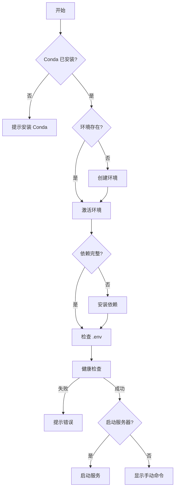

# HoloLang 智能启动脚本说明

## 功能特性

`activate.sh` 是一个智能启动脚本，提供以下功能：

### 🔍 自动检测
- ✅ 检测 conda 是否安装
- ✅ 检测 `hololang` 环境是否存在
- ✅ 验证关键依赖是否完整

### 🛠️ 自动修复
- ✅ 不存在环境时自动创建
- ✅ 依赖缺失时自动安装
- ✅ 缺少 `.env` 时从模板创建

### ✓ 健康检查
- ✅ Python 版本验证
- ✅ 核心模块导入测试
- ✅ 环境完整性检查

### 🚀 一键启动
- ✅ 通过所有检查后询问是否启动服务器
- ✅ 彩色输出，清晰易读

---

## 使用方法

### 方式1：直接运行（推荐）
```bash
./activate.sh
```

### 方式2：使用 bash
```bash
bash activate.sh
```

---

## 运行示例

```
╔════════════════════════════════════════╗
║  HoloLang 智能启动脚本                ║
╚════════════════════════════════════════╝

ℹ  检查 conda 是否安装...
✓ Conda 已安装: conda 24.1.2
✓ Conda 环境 'hololang' 已存在
ℹ  激活环境: hololang...
✓ 环境已激活
ℹ  验证关键依赖...
✓ 所有关键依赖已安装
ℹ  检查环境配置文件...
✓ .env 文件已存在
ℹ  运行健康检查...
✓ Python 版本: 3.10.13
✓ 核心模块导入正常

✓ 所有检查通过！

▶ 是否启动服务器？ [Y/n]: y

ℹ  启动服务器...

═══════════════════════════════════════════
  HoloLang TTS Pipeline Server
═══════════════════════════════════════════

📖 文档: http://localhost:8000/docs
🔧 健康检查: http://localhost:8000/health

按 Ctrl+C 停止服务器
```

---

## 脚本逻辑



---

## 错误处理

脚本使用 `set -e` 确保遇到错误时立即退出，并提供清晰的错误信息。

常见错误：
- **Conda 未安装**: 提示安装链接
- **依赖安装失败**: 显示失败的包名
- **模块导入失败**: 提示检查代码或重装依赖
- **.env 缺失**: 自动从模板创建或提示手动配置

---

## 自定义

可以编辑脚本顶部的配置：

```bash
ENV_NAME="hololang"        # Conda 环境名称
PYTHON_VERSION="3.10"      # Python 版本
```

---

## 手动模式

如果不想自动启动服务器，选择 `n`，脚本会提示手动命令：

```bash
conda activate hololang
python -m app.api.routes
```
