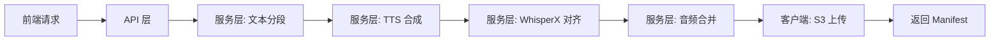

# HoloLang 架构设计文档

## 概述

HoloLang 是一个模块化的多语言 TTS 项目，采用分层架构设计，实现了文本分段、TTS 合成、字符级时间戳对齐和云存储集成的完整流程。

## 架构原则

### 1. 分层架构

项目采用经典的分层架构模式，从下到上依次为：

```
┌─────────────────────────────────────┐
│       API 层 (app/api/)            │  ← FastAPI 路由和依赖注入
├─────────────────────────────────────┤
│     服务层 (app/services/)         │  ← 业务逻辑编排
├─────────────────────────────────────┤
│     客户端层 (app/clients/)        │  ← 外部服务封装
├─────────────────────────────────────┤
│     工具层 (app/utils/)            │  ← 通用辅助函数
├─────────────────────────────────────┤
│     模型层 (app/models/)           │  ← 数据模型定义
└─────────────────────────────────────┘
```

### 2. 单一职责原则

每个模块只负责一个明确的功能：
- **models** - 数据验证和类型定义
- **clients** - 与外部服务通信
- **services** - 业务逻辑组合
- **api** - HTTP 接口暴露
- **utils** - 无状态工具函数

### 3. 依赖注入

使用 FastAPI 的 lifespan 机制管理客户端生命周期，避免全局状态和硬编码依赖。

## 数据流图



## 核心模块详解

### 1. 模型层 (`app/models/`)

#### segment.py
- `TextIn` - 文本输入
- `LangCode` - 语言代码类型（zh/en/ja）
- `SegmentItem` - 单个文本段落
- `TextSegmentsOut` - 分段结果

#### tts.py
- `TTSConfig` - TTS 引擎配置（包含所有 gptsovits 参数）

#### whisperx.py
- `CharTimestamp` - 字符级时间戳（char/start/end）

#### pipeline.py
- `PipelineInput` - 管道输入（**已移除 text_lang**）
- `PipelineOutput` - 管道输出（audio bytes + chars_time bytes）
- `ManifestOut` - S3 上传后的清单

### 2. 客户端层 (`app/clients/`)

#### tts.py
- `TTSClient` - 封装 TTS 服务的 HTTP 调用
- 支持流式和非流式模式
- 自动重试和错误处理

#### whisperx.py
- `WhisperXSingleClient` - 单语种字符级对齐
- `AlignModelCache` - 按语言缓存模型
- 支持前导字符回填

#### s3.py
- `S3Client` - MinIO/S3 存储客户端
- `S3ContentType` - 内容类型枚举
- 支持上传和预签名 URL 生成

### 3. 服务层 (`app/services/`)

#### segmentation.py
- `segment_text()` - 多语言文本分段
- 使用 Lingua 进行语言检测
- 支持日语粘合修正（ja-zh-ja 夹心、假名牵引）

#### pipeline.py
- `run_pipeline()` - 完整的 TTS 管道流程
- 协调文本分段、TTS 合成、时间戳对齐和音频合并
- 确保 WAV 参数一致性

### 4. API 层 (`app/api/`)

#### dependencies.py
- `lifespan()` - FastAPI 应用生命周期管理
- 初始化和清理客户端实例

#### routes.py
- `POST /pipeline` - 主管道接口
- `GET /health` - 健康检查
- 返回包含预签名 URL 的 Manifest

### 5. 工具层 (`app/utils/`)

#### audio.py
- `read_wav_params_and_frames()` - 读取 WAV 参数和帧
- `concat_wav_frames()` - 拼接 WAV 帧
- `get_wav_duration()` - 获取音频时长

### 6. 配置层 (`app/config.py`)

统一管理所有环境变量：
- API 配置（主机、端口）
- TTS 服务配置（URL、超时）
- WhisperX 配置（设备选择）
- S3 配置（endpoint、credentials、bucket）

## 关键设计决策

### 1. 移除 `text_lang` 字段

**原因**：
- 项目已实现自动语言检测（`segment_api`）
- `text_lang` 字段冗余且可能与实际content不符
- 简化前端调用，减少混淆

### 2. 使用 Bytes 传递音频和时间戳

**原因**：
- 避免文件系统 I/O
- 内存效率高
- 便于测试和单元化

### 3. WAV 参数一致性检查

**原因**：
- 不同 TTS 引擎可能返回不同的采样率/位宽/声道
- 确保合并后的音频质量一致
- 提前发现配置问题

### 4. 依赖注入而非全局变量

**原因**：
- 便于单元测试（可Mock）
- 避免循环依赖
- 支持多实例部署

## 扩展性设计

### 添加新的 TTS 引擎

1. 在 `app/clients/` 创建新的客户端类
2. 实现统一的 `get_tts_wav(text, lang, config)` 接口
3. 在 `app/api/dependencies.py` 注册新客户端
4. 更新配置管理支持新的环境变量

### 添加新的语言

1. 在 `app/models/segment.py` 更新 `LangCode` 类型
2. 在 `app/services/segmentation.py` 添加语言检测规则
3. 确保 WhisperX 支持该语言的对齐模型

### 添加新的存储后端

1. 在 `app/clients/` 创建新的存储客户端
2. 实现 `upload()` 和 `presign()` 接口
3. 在依赖注入中切换实现

## 性能优化

### 1. 模型缓存
- WhisperX 对齐模型按语言缓存
- 避免重复加载

### 2. 批量处理
- TTS 支持 `parallel_infer` 并行推理
- 分段合并避免多次 I/O

### 3. 异步处理
- FastAPI 异步上下文管理
- S3 上传可改为异步

## 测试策略

### 单元测试
- 每个客户端独立测试（使用 Mock）
- 服务层逻辑测试
- 模型验证测试

### 集成测试
- 完整管道流程测试
- 端到端API测试
- 错误处理测试

### 性能测试
- 并发请求压力测试
- 内存使用监控
- 响应时间分析

## 部署建议

### Docker 部署
```dockerfile
FROM python:3.10-slim
WORKDIR /app
COPY requirements.txt .
RUN pip install -r requirements.txt
COPY app/ app/
CMD ["uvicorn", "app.api.routes:app", "--host", "0.0.0.0", "--port", "8000"]
```

### 环境隔离
- 开发环境：本地 TTS/S3
- 测试环境：Docker Compose
- 生产环境：K8s + 外部 S3

### 监控和日志
- 使用结构化日志（JSON）
- 添加 Prometheus 指标
- 集成 Sentry 错误追踪

## 未来展望

1. **流式处理** - 支持音频流式返回
2. **多 TTS 引擎** - 同时支持多个 TTS 后端
3. **缓存层** - Redis 缓存常见文本的结果
4. **队列系统** - Celery 异步任务处理
5. **WebSocket** - 实时进度推送

---

**版本**: 2.0.0  
**最后更新**: 2026-01-31
